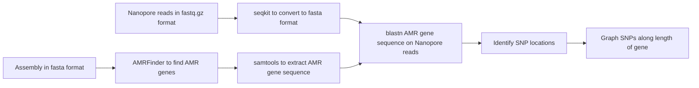

# nanoAMR

This is the python script that was used to determine the SNP distributions of AMR genes on nanopore reads. I do not see a real use for this tool outside of my small project, but [submit an issue](https://github.com/erinyoung/nanoAMR/issues) if it does have some additional practicality and is not working correctly.



## Installation

### bioconda (preferred)
```
conda install -c bioconda nanoamr
```

### From source

Install dependencies:
- [blast](https://www.ncbi.nlm.nih.gov/books/NBK569861/)
- [amrfinder](https://github.com/ncbi/amr/wiki/Installing-AMRFinder)

```
git clone https://github.com/erinyoung/nanoAMR
cd nanoAMR
pip install .
```

Or install with
```
pip install nanoamr
```

## Usage
```
nanoamr -n reads.fastq.gz -f fasta.fna -o outdir
```

## Output

For each AMR gene, there should be a csv (or json?) file that lists the AMR gene, the number of reads, and the locations of the SNPs.

There should also be a figure displaying the location of each SNP and the proportion of reads with that SNP.

## Citations:

currently unpublished


